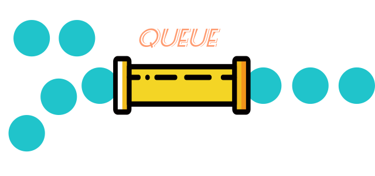

# async-fn-queue
> 一个异步函数队列化执行库



# Intro
这个库可以将多个异步操作在队列中执行，并且能动态追加异步操作，满足在特殊场景下串行化异步操作需求

# Install

``` sh
npm install async-fn-queue --save

```

# Api
``` js
import queue from 'async-fn-queue'

// 创建或获取一个队列
let q = queue.get('queue_name')

// 将异步操作函数添加到队列（入队）
q.push(async () => {
    // 异步操作 F1
})
q.push(async () => {
    // 异步操作 F2
})

// 同时也支持同步操作
q.push(() => {
    // 同步操作 F3
})

// 开始执行队列中的异步操作（将依次执行操作 F1、F2、F3）
q.start()

// 调用 start 后追加的新异步操作需要显性调用 start 才会执行
q.push(async () => {
    // 异步操作 F4（将在 F1、F2、F3 执行完后开始执行 F4）
}).start()

// 添加并执行下一个异步操作，等同于 q.push(fn).start()
q.next(async () => {
    // 异步操作 F5（将在 F1、F2、F3、F4 执行完后开始执行 F5）
})

// 暂停执行队列中的异步操作
q.pause()

// 停止执行并清除队列中的异步操作
q.stop()

// 支持链式调用
q.push(fn).push(fn).start().next(fn).pause().stop()

```

# Usage

下面是一个数据同步的示例，在同步本地和服务器数据时，我们通常希望串行化请求，于是我们可以使用异步队列来进行操作

``` js
import queue from 'async-fn-queue'
import http from 'axios'

/**
 * 同步数据
 */
function sync () {
    // 使用队列名获取队列（不存在则自动创建）并执行该队列
    queue.get('sync').next(async () => {
        // 获取本地数据
        let localData = JSON.parse(localStorage.getItem('data'))
        // push 到服务端
        await http.post('/data/push', localData)

        // 拉取服务端新数据
        let newData = await http.post('/data/pull')
        // 合并到本地
        localData = localData.concat(newData)
        localStorage.setItem('data', JSON.stringify(localData))
    })
}

// 获取同步按钮
let btn = document.getElementById('#btn-sync')

// 无论用户连续点击或直接调用 sync 函数多少次，接口都只会串行请求
btn.pushEventListener('click', sync)

sync()
sync()
sync()
...

```